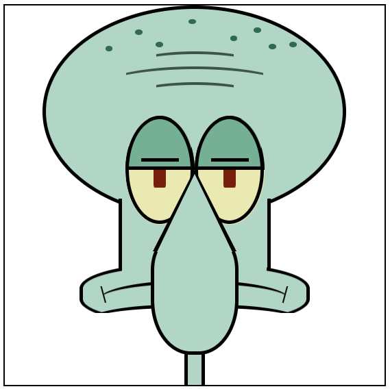
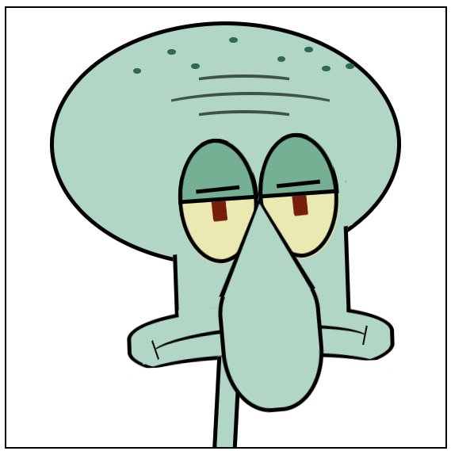

# CSS Squidward

Pure CSS Squidward

First version!

Online example hosted in Github Pages: https://thisago.github.io/cssSquidward/

Looking to front  

Looking to right  

Looking to left  

## TODO

- [x] Missing nose!

## License

MIT
